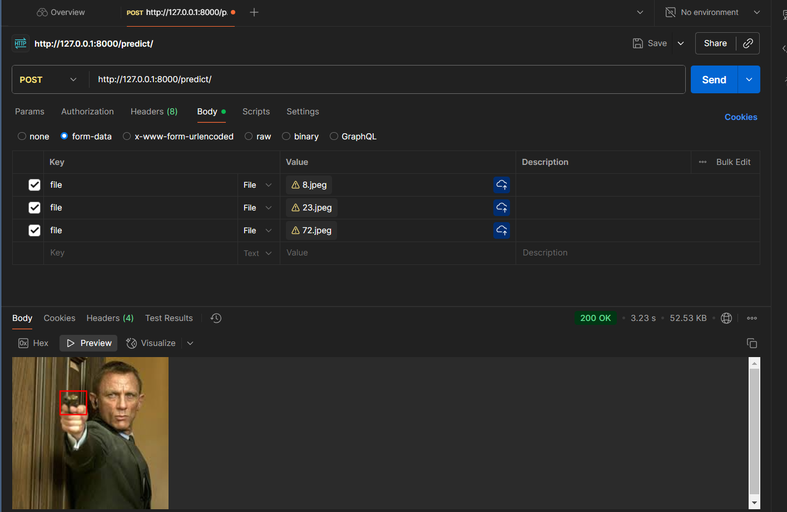

Jupyter notebook testing "https://www.kaggle.com/code/nileshnandants/gunsobjectdetection"

Tools used Python, DVC, Tensorboard
Models and packages used Pytorch, Faster-RCNN, FastAPI

Detected guns in the given image. Model was trained on GPUP100 and used that model for inference. Tested the applicaition API using Postman and swagger

